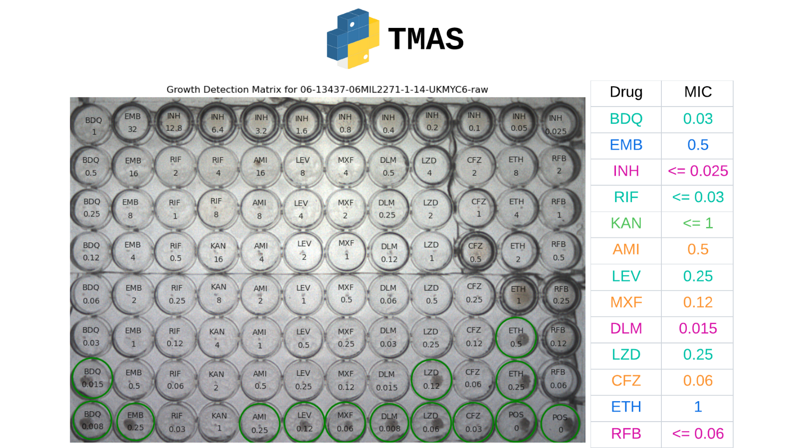

# TB Microbial Analysis System (TMAS)


[](https://opensource.org/licenses/MIT)


[](https://badge.fury.io/py/tmas)
[](tb-microbial-analysis-system-tmas.readthedocs.io/en/latest/?badge=latest)
<!--  -->


<!-- [](https://codecov.io/gh/Oucru-Innovations/tmas) -->

## Overview

The package uses deep learning to detect M. tuberculosis growth in 96-well microtiter plates and determines **Minimum Inhibitory Concentrations (MICs)**.
<!-- - The model weights (``best_model_yolo.pt``) is downloaded automatically and separately to avoid including large files directly in the package. It is downloaded only once. -->

## Features
- **Data Preprocessing**: Plate images are preprocessed by applying various image processing techniques: **Mean Shift Filter**, **Contrast-Limited Adaptive Histogram Equalization filter** (CLAHE), and **Pixel histogram normalisation**. The images are then resized and padded to fit the detection model’s input.
- **Growth Detecting**: A pre-trained deep learning model (***YOLOv8***) is used to detect the bacterial growth in each well of the plate.
- **Plate output analysis**: The detection output is analysed to ensure bacterial growth in control wells, which are drug-free, to validate the experimental conditions.
- **MIC Mapping**: Match the detected growths with the dilution and concentration matrix of each drug to extract ***Minimum Inhibitory Concentrations*** (MICs) corresponding to a specific plate design.

## Installation

### Installation - Python Package
1. Install the Python package from PyPi
   ```bash
   $ pip install tmas==1.0.2
   ```

2. Run ``TMAS`` on your Terminal
   ```bash
   $ run_tmas [folder_path] [output_format]
   ```
- folder_path: The direct path to the folder of the raw images
- output_format: output MIC of each drug in ``csv`` or ``json`` file (default format is ``csv``)
   

   or

   ```bash
   $ run_tmas [file_path] [output_format]
   ```
- file_path: The path to the raw image
- output_format: output MIC of each drug in ``csv`` or ``json`` file (default format is ``csv``)
- **NOTE**: Make sure your `file_path` ends with ***-raw.png***

### Installation - GitHub

1. Clone the repository and navigate to the project directory.
   ```bash
   $ git clone https://github.com/Oucru-Innovations/tmas.git
   $ cd tmas
   ```

2. Install the ``TMAS`` package using:

   ```bash
   $ pip install -e .
   ```

   This may take a while if those packages are not available in the current environment. The internet connection and the hardware capacity also affect the installation speed.

3. Run ``TMAS``:

   ```bash
   $ run_tmas [file_path] [output_format]
   ```

- file_path: the direct path to the raw image
- output_format: output MIC of each drug in ``csv`` or ``json`` file (default format is ``csv``)
- **NOTE**: Make sure your `file_path` ends with ***-raw.png***


   or

   ```bash
   $ run_tmas [folder_path] [output_format]
   ```
<!-- - (Optional) -visualize/--visualize: to illustrate the output image  -->
- folder_path: The path to the folder of the raw images
- output_format: output MIC of each drug in ``csv`` or ``json`` file (default format is ``csv``)
<!-- - Example: python -m scripts.run_tmas data/1 csv -->

If encounting any error in Installing the packages, please refer to the Debugging section.


## Tutorial 

1. Explore the examples folder

   ```bash
   $ cd data
   $ ls
   1/ 2/ 3/ 4/ 5/
   ```

   In each examples folder, there is a raw iamge

   ```bash
   $ ls 1/
   01-DR0013-DR0013-1-14-UKMYC6-raw.png
   ```

2. To process and analyse a single image using the default settings is simply

   Choose your desired MIC output file:
   ### json
      - To run only one image:

   ```bash
   $ run_tmas data/1/01-DR0013-DR0013-1-14-UKMYC6-raw.png json
   ```

      - To run the whole folder:

   ```bash
   $ run_tmas data/1 json
   ```

   ### csv
   - To run only one image:

   ```bash
   $ run_tmas data/1/01-DR0013-DR0013-1-14-UKMYC6-raw.png csv
   ```

   - To run the whole folder:

   ```bash
   $ run_tmas data/1 csv
   ```
3. Growth detection output:

   

4. Output files:
   After ``TMAS`` has done running, the growth detection and MIC results will be displayed in your terminal.

   Not only that, the growth detection image and the MIC results file with the chosen format will be saved in the same folder with the input image.

   ```bash
   $ ls -a 1/
   output/ 01-DR0013-DR0013-1-14-UKMYC6-raw.png
   $ ls -a 1/output/
   01-DR0013-DR0013-1-14-UKMYC6-growth-matrix.png
   01-DR0013-DR0013-1-14-UKMYC6-mics.csv
   01-DR0013-DR0013-1-14-UKMYC6-mics.json
   01-DR0013-DR0013-1-14-UKMYC6-filtered.png
   ```
   - ``01-DR0013-DR0013-1-14-UKMYC6-raw.png`` is the original image.
   - ``01-DR0013-DR0013-1-14-UKMYC6-filered.png`` is the filtered image after preprocessing.
   - ``01-DR0013-DR0013-1-14-UKMYC6-growth-matrix.png`` is the image with the growth detection plotted.
   - ``01-DR0013-DR0013-1-14-UKMYC6-mics.csv`` contains the information, including filename, drug name, growth detection results, MIC result.
   - ``01-DR0013-DR0013-1-14-UKMYC6-mics.json`` contains the same information as the ``csv`` file but in a different format per requested.
   
To see the other options available for the `run_tmas` python script:
```bash
$ run_tmas --help
usage: run_tmas [-h] [-visualize] path [{csv,json}]

Run TMAS for image processing, growth detection, and MIC analysis.

positional arguments:
  path                  Path to the image or directory containing images.
  {csv,json}            Format type for saving results: 'csv' or 'json'.

optional arguments:
  -h, --help            Show this help message and exit
  -visualize, --visualize
                        Display images with growth detection results.   
```     

## Usage

Please read the [instruction in the documentation](https://tb-microbial-analysis-system-tmas.readthedocs.io/en/latest/?badge=latest) for detailed usage examples and module descriptions.

## Debugging

- If you encounter an error in Step 2 (unable to download any package), you can try creating a new environment and continue with the installation code:

1. Set Up a New Virtual Environment

   ```bash
   $ conda create -n tmas_env python=3.9
   $ conda activate tmas_env
   ```

2. Clone the repository and navigate to the project directory.
   ```bash
   $ git clone https://github.com/Oucru-Innovations/tmas.git
   $ cd tmas
   ```

3. Install the package using:

   ```bash
   $ pip install -e .
   ```

   This may take a while if those packages are not available in the current environment. The internet connection and the hardware capacity also affect the installation speed.

4. Run `TMAS`:

   ```bash
   $ run_tmas [folder_path] [output_format]
   ```

- folder_path: the folder contains the image
- output_format: output MIC of each drug in csv or json file
- **Example**: please refer to ``Tutorial Session``

If you finished installing `TMAS` package but `run_tmas` direct you to your github path, you can try creating a virtual environment and try installing the package again:

1. Set Up a New Virtual Environment

   ```bash
   $ conda create -n tmas_env python=3.9
   $ conda activate tmas_env
   ```
2. Install `TMAS` package:
   ```bash
   pip install tmas==1.0.1
   ```
3. Run `TMAS`:
   ```bash
   run_tmas [folder_path] [output_format]
   ```
   <!-- - (Optional) -visualize/--visualize: to illustrate the output image  -->
   - folder_path: The path to the folder of the raw images
   - output_format: output MIC of each drug in ``csv`` or ``json`` file (default format is ``csv``)


## Documentation
Comprehensive documentation for each module is available in the `docs/` directory, covering usage examples, API references, and more.

## Contributing
We welcome contributions! Please read the [CONTRIBUTING.md](tmas/CONTRIBUTING.md) file for guidelines on how to contribute to this project.

## License

`TMAS` was created by RMIT 2OO2 TEAM. It is licensed under the terms of the MIT license.

## Credits

`TMAS` was created with [`cookiecutter`](https://cookiecutter.readthedocs.io/en/latest/) and the `py-pkgs-cookiecutter` [template](https://github.com/py-pkgs/py-pkgs-cookiecutter).
